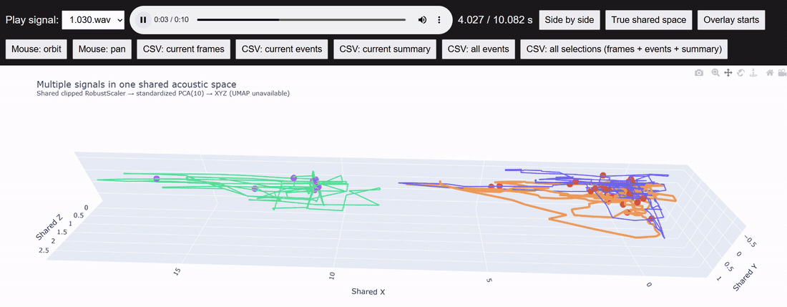

PURPOSE

This pipeline was developed for a specific humpback whale song analysis
task. The original goal was to compare a large number of short vocal
units, identify supported candidate matches, and use manually validated
recurrent units to explore possible song-theme reconstruction.

Example playback of an acoustic signal represented as a time-dependent
trajectory in the shared multivariate acoustic space.

A central principle of the pipeline is machine-based matching followed
by human validation. Rather than asking multiple independent observers
to visually or aurally classify the same units and then reconcile their
judgements, the same quantitative procedure is applied systematically
to all candidate comparisons. Human judgement is retained at the
validation stage: the algorithm proposes acoustically supported
candidates, while the reviewer decides whether those candidates should
be accepted as recurrent units.

The acoustic representation deliberately combines multiple complementary
properties of each signal, including amplitude, spectral distribution,
spectral shape, temporal spectral change, periodicity, and the
log-Mel spectral envelope. These measurements are combined into a
multivariate acoustic trajectory rather than used as separate matching
criteria. Consequently, trajectory similarity reflects agreement across
multiple aspects of signal structure instead of depending on a single
measurement such as pitch, duration, or frequency range.

This is also useful for evaluating the behaviour of the matcher itself.
The algorithm does not recover only visually obvious recurrent units.
It can also retrieve acoustically related but non-identical structures,
including mirrored or reversed trajectory patterns. Such results are
particularly informative during validation because they show that the
matcher responds reproducibly to the geometry of the acoustic
trajectories rather than simply reproducing the initial manual
classification. Candidate matches and systematic non-matches can
therefore both provide information about matcher behaviour.

The first two analytical stages are useful beyond this particular
dataset. They convert short acoustic signals into trajectories in a
shared feature space and compare those trajectories quantitatively.
They can be used independently of any theme reconstruction.

The basic workflow is:

    short WAV signals
            |
            v
    multivariate acoustic representation
            |
            v
    shared acoustic trajectories
            |
            v
    machine trajectory matching
            |
            v
    candidate matches
            |
            v
    manual validation

The Theme Graph Builder is an optional and more task-specific extension.
For the original humpback-song analysis, it was designed as an attempt
at an independent machine reconstruction after recurrent-unit groups
had been manually validated. Rather than being given a manually
reconstructed theme and attempting to reproduce it, the graph procedure
uses the observed ordering of validated recurrent units to construct a
transition network and search for repeated sequential structure.

Its role can therefore be summarized as:

    manually validated recurrent-unit groups
                    |
                    v
        observed unit transitions
                    |
                    v
             transition graph
                    |
                    v
       repeated transition structure
                    |
                    v
      candidate sequence reconstruction

The resulting reconstruction can then be compared with the independently
derived manual interpretation. Agreement between the two is informative
because the graph procedure is not supplied with the expected theme
structure in advance.

The Theme Graph Builder should nevertheless be treated as an exploratory
tool developed for this particular humpback-song reconstruction problem,
not as a universal acoustic sequence classifier.
